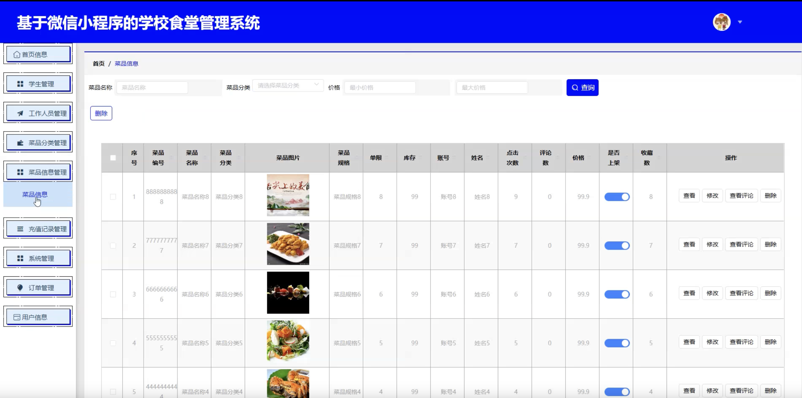
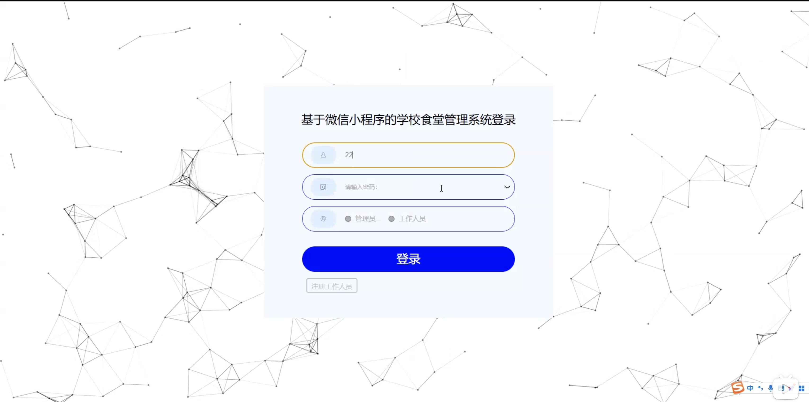
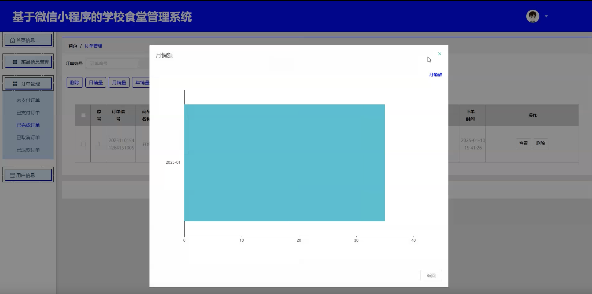
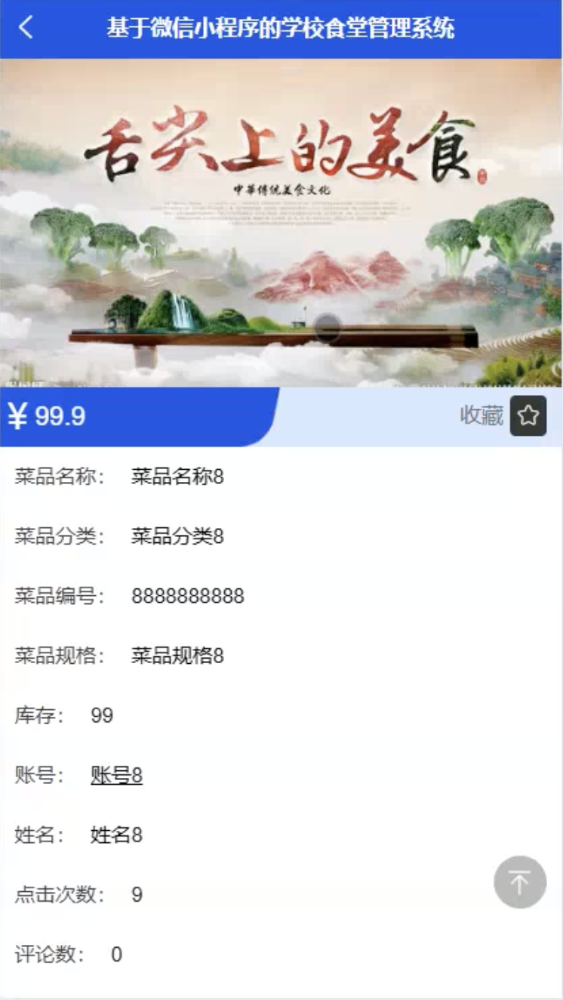
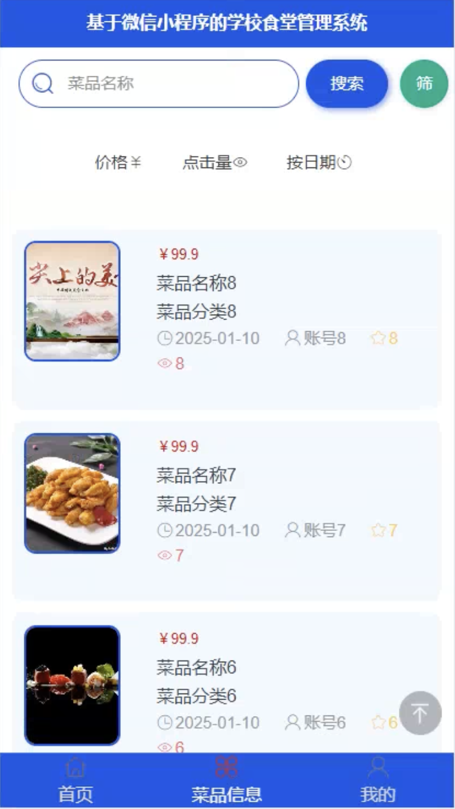
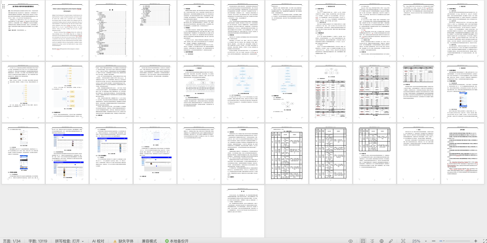

# mpweixinA238D
mpweixinA238D学校食堂点餐微信小程序+LW+PPT
 
## 源码问题查看主页咨询

### 一、关键词
食堂系统、校园食堂系统、餐厅点餐系统、学校订餐系统、食堂管理系统

### 二、作品包含
源码+数据库+万字设计文档+PPT+全套环境和工具资源+本地部署教程

### 三、项目技术
前端技术： Html、Css、Js、Vue2.6、Element-ui、uniapp
后端技术：Java、SpringBoot2.2.2、MyBatis

### 四、运行环境（以下版本亲测，其他版本兼容性请自行测试）
开发工具：IDEA/eclipse + VSCODE + HBuilder X + 微信开发者工具

数据库：MySQL 5.7+

数据库管理工具：Navicat10以上版本

环境配置软件： JDK1.8 + Maven3.6+

前端Nodejs：14+

浏览器：谷歌浏览器

### 五、项目介绍
项目编号：mpweixinA238D

基于微信小程序的学校食堂点餐系统，方便学生和工作人员在线点餐，提升食堂管理效率和用餐体验。

角色：管理员、学生、工作人员

学生功能：注册登录、浏览菜品、在线点餐、订单管理、充值缴费、评价反馈、个人中心。

工作人员功能：登录、订单处理、菜品制作管理、订单配送、个人中心。

管理员功能：登录、学生管理、工作人员管理、菜品管理、分类管理、订单管理、充值管理、评价管理、系统设置。

数据库表16个。

### 六、运行截图

